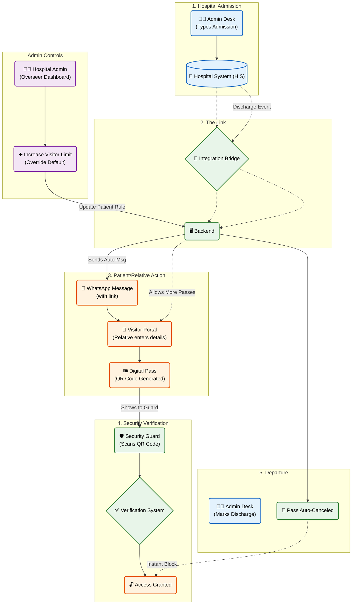

### Explaining the End-to-End Flow (Layman's Guide)

**Step 1: Patient Admission**  
Hospital staff admits a patient in their existing system (HIS). They don't need to change their workflow.

**Step 2: The Invisible Bridge**  
Our system automatically detects the new admission and grabs the details (Name, Phone Number, Room).

**Step 3: WhatsApp & Pre-Registration**  
The patient instantly receives a WhatsApp message with a "Visitor Link." They (or a relative) click it to enter visitor details (Name, ID, etc.) from their own phone. Once done, a **Digital QR Pass** is generated on their screen.

**💡 Admin Override (New!)**  
By default, the system might allow only 2 visitors. However, a **Hospital Admin** can log into the Dashboard at any time to increase the visitor count for a specific patient. If they increase the limit to 4, the visitor link will automatically allow 2 more relatives to register.

**Step 4: Secure Entry (QR Verification)**  
When a relative reaches the hospital, they show the QR pass. The Security Guard scans it with our app. The system confirms the patient is still admitted and grants access.

**Step 5: Auto-Cancellation on Discharge**  
The moment the staff marks the patient as "Discharged" in the HIS, our system automatically cancels all active visitor passes for that patient. Security will see "Access Denied" if anyone tries to use those old passes.
