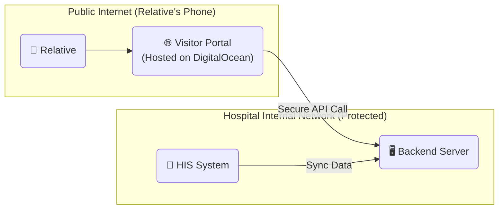

# Network Bridge Solutions: Internal HIS vs External Relatives

This guide outlines how to make your visitor registration link accessible to relatives on mobile networks while keeping your core hospital system secure.

## The Problem
Your system is on the **Hospital LAN**, but relatives are on **Public Mobile Data**. They can't "see" your local IP address through a WhatsApp link.

---

## Solution A: The Secure Tunnel (Easiest to Set Up)
You keep everything running on the hospital server, but use a "Tunnel" to give it a public address.

### Use: [Cloudflare Tunnel](https://www.cloudflare.com/products/tunnel/) (Free & Secure)
1. **Install:** Run a small program called `cloudflared` on your hospital server.
2. **Tunnel:** It creates a secure outbound connection to Cloudflare.
3. **Public URL:** Cloudflare gives you a link like `https://register.yourhospital.com`.
4. **Safety:** No need to open firewall ports or use port forwarding.

---

## Solution B: The Cloud Relay (Professional/Scalable)
You host the "Visitor Facing" parts on the cloud (DigitalOcean) and keep the "Secure" parts inside.

### Steps:
1. **Frontend:** Deploy your React app to DigitalOcean App Platform (using your `app.yaml`).
2. **Cloud API:** Deploy your Node.js backend to a public server (or as a separate cloud service).
3. **Database Sync:** The Backend inside the hospital "Pushes" admission data to the Cloud Backend whenever someone is admitted.

---

## Solution C: Static IP & Port Forwarding (Old School)
Ask the hospital IT for a **Public Static IP** and a **Port Forward (443)** for the server.

* **Pros:** Simplest architecture.
* **Cons:** Most Hospital IT departments will say **"NO"** for security reasons (vulnerability to hackers).

---

## Recommendation 🌟
**Use Solution A (Cloudflare Tunnel).**  
It's the industry standard for "bridging" a local server to the internet without compromising security. You can set it up in 10 minutes, and the relatives will get a professional `https://` link that works on their 5G/4G immediately.

Would you like me to show you the commands to set up the Cloudflare Tunnel?
